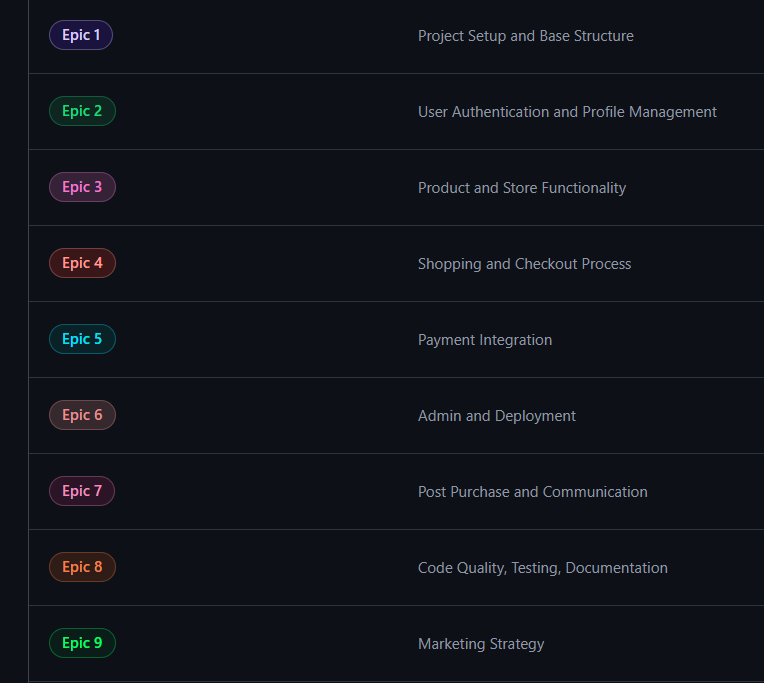
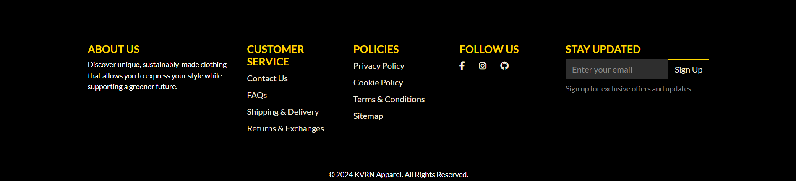

# KVRN Apparel

KVRN Apparel is a custom-designed e-commerce platform that combines sleek aesthetics with a user-centric shopping experience. The project leverages Django and integrated services such as AWS and Stripe to deliver a fully functional online store tailored for fashion-forward individuals. From product browsing and wishlist functionality to secure checkout and design submission, KVRN Apparel offers an engaging, community-driven approach to online apparel shopping. The platform is designed to be highly responsive, optimized for performance, and scalable, making it suitable for continuous growth and feature expansion.


The project was developed using agile principles, focusing on building a Minimum Viable Product (MVP) while allowing flexibility for future enhancements. KVRN's core features include account creation, order history tracking, user-submitted design competitions, and an accessible, visually engaging layout. Below is an example of the platform’s responsive design, demonstrating how KVRN adapts across different devices to maintain a consistent and user-friendly experience.


---

Here’s the Table of Contents with the top-level headings and emojis:

markdown
Copy code
## Table of Contents

- [KVRN Apparel](#kvrn-apparel)
- [Introduction](#introduction)
- [Objectives](#objectives)
- [Target Audience](#target-audience)
- [Problem Being Solved](#problem-being-solved)
- [Scope](#scope)
- [📊 Business and Marketing Plan](#-business-and-marketing-plan)
- [🛠️ Development Plan](#️-development-plan)
- [🎨 UX/UI Design Plan](#-uxui-design-plan)
- [🚀 Features](#-features)
- [🔮 Future Enhancements](#-future-enhancements)
- [🧪 Testing](#-testing)
- [🖥️ Technologies Used](#️-technologies-used)
- [🗃️ Custom Models Breakdown](#️-custom-models-breakdown)
- [📦 Setup and Installation (GitHub and Heroku)](#-setup-and-installation-github-and-heroku)
- [👥 Credits & Acknowledgements](#-credits--acknowledgements)

## Introduction
**Disclaimer**: *None of these items are for sale. This store is a mockup for portfolio purposes only. If you wish to test the functionality please use the stripe developer card 4242 4242 4242 4242.*

*All products on the site are completely custom made and designed using online tools and mockup generators. None of these items are purchasable.*

**KVRN Apparel**- is a custom apparel e-commerce platform that offers a sleek, user-friendly shopping experience for modern consumers. Built with Django, the platform showcases a variety of apparel items with a focus on unique, stylish designs that cater to a broad audience. KVRN Apparel integrates key features, including a Wishlist, product filtering by gender, user reviews, and a live competition. 

The project’s aim is to create a responsive and visually appealing online store that seamlessly guides users from browsing to checkout, with secure payment processing through Stripe. The store’s design and branding align with KVRN’s core identity: bold aesthetics, quality, and simplicity. This project also includes a unique competition feature where users can submit graphic designs, with winning designs featured on apparel items and royalties awarded to creators (this is a mockup, there is no royalties to be awarded).

KVRN Apparel was developed with attention to both business and technical goals, ensuring that users have a smooth, engaging experience across devices while meeting essential requirements for scalability, maintainability, and e-commerce best practices.

[⬆️Back to top](<#KVRN-Apparel>)

## Objectives

The primary objectives for **KVRN Apparel**- are:

1. **User-Centric Shopping Experience:**- Provide an intuitive, seamless shopping experience with essential features like Wishlist, product reviews, and personalized user profiles. 

2. **Visual Appeal and Brand Consistency:**- Ensure a bold, sleek aesthetic that aligns with KVRN's brand identity, resonating with modern consumers and differentiating the brand in the e-commerce space.

3. **Responsive Design:**- Develop a fully responsive site that delivers a smooth browsing experience across desktops, tablets, and mobile devices.

4. **Secure and Efficient Checkout:**- Integrate Stripe for secure payments and customized delivery options, including multi-currency support for flexibility with international buyers.

5. **Community Engagement:**- Introduce a user-driven competition feature allowing users to submit graphic designs for apparel, fostering engagement and brand loyalty. Creators of selected designs receive royalties.

6. **Scalability and Maintainability:**- Build a robust, scalable application that adheres to best practices in code quality, SEO, and security, preparing the store for future growth.

These objectives guide the project development, ensuring that KVRN Apparel meets user expectations while fulfilling business requirements and delivering a lasting impact in the apparel e-commerce market.

[⬆️Back to top](<#KVRN-Apparel>)

## Target Audience

**KVRN Apparel**- is designed for style-conscious individuals looking for unique, high-quality apparel that combines bold design with a sleek, modern aesthetic. The target audience includes:

1. **Young Adults (Ages 18-35):**- Primarily targeting a demographic interested in contemporary fashion, self-expression, and unique designs that stand out.

2. **Creative Individuals:**- People with an interest in art and design, especially those who might participate in KVRN’s design submission competition to have their artwork featured on apparel.

3. **Tech-Savvy Shoppers:**- Online shoppers who expect a seamless, mobile-friendly experience and appreciate features like Wishlist, product reviews, and quick, secure checkouts.

[⬆️Back to top](<#KVRN-Apparel>)

## Problem Being Solved

**KVRN Apparel**- addresses several key challenges in the online apparel shopping space, aiming to enhance user experience, brand loyalty, and operational efficiency. The problems being solved include:

1. **Streamlining the Shopping Experience:**- Many online stores lack intuitive navigation and product filtering, which can frustrate users. KVRN tackles this by offering responsive product filtering by gender and price, a Wishlist feature for favorites, and an organized catalog for quick product discovery.

2. **Enhancing Post-Purchase Engagement:**- Traditional e-commerce stores often lack effective ways for users to interact with their orders post-purchase. KVRN’s per-item rating system within orders encourages users to provide feedback, helping improve the shopping experience while gathering valuable product insights. The rating is managed through a convenient Bootstrap modal that can be updated, while automatically disabling ratings for products that have been removed from the store. This ensures a seamless user experience and data accuracy.

3. **Building Community and Brand Loyalty:**- By enabling users to submit their own designs in a competition format, KVRN fosters community involvement and deepens brand loyalty. Competition entries are managed dynamically, allowing users to update submissions and engage with KVRN’s brand in a creative way, with the added incentive of royalties for winning entries.

Through these solutions, KVRN Apparel addresses both common e-commerce pain points and unique challenges related to community engagement, encouraging a lasting connection with users.

[⬆️Back to top](<#KVRN-Apparel>)

## Scope

### 1. Project Overview

- **Objective**: The KVRN Apparel project aims to create a full-featured e-commerce platform for selling custom apparel. The site will be user-centric, showcasing an aesthetically pleasing interface, easy navigation, and a seamless purchasing experience. It will cater to customers who value unique, stylish fashion, allowing them to engage with the brand and make confident purchases.

- **Target Audience**: Primarily targeting a younger, fashion-forward audience interested in custom clothing and an engaging, functional online shopping experience.

### 2. Core Features and Functionality

#### Product Display and Filtering
- Users can browse products presented with high-quality images, descriptions, prices, and available sizes.
- **Filtering and Sorting**: Users can filter and sort products by price, rating, category, and other relevant criteria to easily locate items.

#### Product Management
- **Admin CRUD Operations**: Admins have full control over product management through both an admin panel and a front-end interface, allowing for seamless product creation, updates, and deletions.
- **Product Categorization**: Products are organized by categories, ensuring users can navigate easily to find specific types of items.

#### Shopping Cart and Checkout
- **Shopping Cart**: Users can add items to a shopping cart, view selected products, adjust quantities, and see the total price before checkout.
- **Guest Checkout**: Allows customers to complete their purchase without creating an account.
- **Stripe Integration**: The site integrates with Stripe for secure payment processing, ensuring all transactions are safe and straightforward.
- **Order Confirmation and History**: After checkout, users receive an email confirmation. Logged-in users can also view past orders in their profile.

#### User Profiles and Authentication
- **User Registration and Login**: Users can create an account to save information, view order history, and manage wishlists.
- **Profile Management**: Users have access to their profiles, where they can update personal information, review past purchases, and save products to wishlists.

#### Wishlist
- **Save Products for Later**: Users can add items to a wishlist from the product page for later purchase. The wishlist is easily accessible from the user profile.

#### Notifications and Feedback
- **Toast Notifications**: Users receive notifications for actions such as adding to cart, updating product quantities, and successful checkout, providing feedback on key interactions.

#### Design Submission and Community Engagement
- **User Design Submission**: Users can submit designs for potential feature on products, with selected designs earning royalties. This feature fosters community engagement and encourages creativity.
- **Contest and Updates**: The competition feature lets users view their own submissions and update them before they are being reviewed, while admin can monitor and manage submissions.

### 3. Optional Features for Future Iterations

- **Blog**: Adding a blog section for engaging content, such as fashion tips and updates on the brand, to foster community engagement.
- **Abandoned Cart Reminders**: Sending automated emails to users who leave items in their cart, encouraging them to complete purchases.
- **Multicurrency Support**: Enabling customers to view prices in their local currency.
- **Quick View**: Providing a quick-view feature on product listings so customers can view basic details without leaving the page.

### 4. User Experience and Accessibility

- **Mobile Optimization**: Ensuring all pages are responsive, providing a smooth experience on mobile and desktop.
- **SEO Optimization**: Implementing SEO best practices to improve search engine visibility.
- **Accessibility**: Conducting accessibility checks to ensure the site is usable for all visitors, including those with disabilities. While some accessibility improvements were limited by time, they remain a priority for future iterations.

### 5. Testing and Documentation

- **Testing**: Comprehensive manual and integration testing for all core functionalities to ensure a bug-free user experience.
- **Lighthouse Audits**: Desktop and mobile Lighthouse audits are conducted to assess performance, accessibility, and SEO scores. Some scores are sub-optimal due to time constraints, but significant improvements were made within the project timeline. Future revisions will focus on SEO and accessibility enhancements.

### 6. Deployment and Marketing Strategy

- **Final Deployment**: The project is deployed on Heroku, with all necessary configurations and environment variables set for production.
- **Social Media Integration**: Links to social media channels, such as Instagram and Facebook, are included to build community and drive traffic to the website.
- **Marketing Strategy**: A Facebook business page and Instagram presence will help reach a wider audience, share new products, and engage with customers.

---

The KVRN Apparel project follows Agile development principles, focusing on delivering an MVP with core features prioritized first. Non-essential features were shifted to future iterations based on project needs, ensuring timely deployment while maintaining quality. The project board reflects this adaptive approach, with some stories moved between milestones, showcasing the flexibility and iterative nature of the development lifecycle.

[⬆️Back to top](<#KVRN-Apparel>)

## 📊 Business and Marketing Plan

The KVRN Apparel brand’s business and marketing plan is designed to build awareness, engagement, and loyalty through strategic use of social media and targeted marketing efforts. With a background in Social Media Marketing and Advertising (SMMA), a completed business and marketing course, and hands-on experience in driving engagement and brand growth, I’m well-prepared to leverage proven strategies to promote KVRN Apparel effectively.

### Business Goals
1. **Establish Brand Identity**: Build a strong, recognizable brand presence on social media platforms, with a focus on organic engagement and user interaction.
2. **Drive Sales through Direct Marketing**: Utilize social media and in-site engagement strategies to drive traffic and conversions on the e-commerce site.
3. **Foster Community Engagement**: Use campaigns, contests, and content creator partnerships to engage with customers and build a community around KVRN Apparel.

### Marketing Strategy

#### 1. In-Site Marketing Strategies for Engagement
- **Email Newsletter Signup**: Located in the footer, the email newsletter encourages users to subscribe for updates on new products, exclusive discounts, and KVRN Apparel news. Newsletters provide a direct communication channel, promoting repeat visits and purchases.
- **Design Submission Competition**: Users can submit designs for potential feature on products, with royalties offered for selected designs. This competition incentivizes creative engagement and draws in users interested in apparel design. [See competition ad for reference.](documentation/marketing/facebook-submission-ad.png)
- **Wishlist Feature**: The wishlist allows users to save products, providing a way to revisit desired items. This feature encourages return visits and, combined with email reminders, can increase conversion rates.

#### 2. Social Media Marketing Channels

##### Instagram
- **Account Link**: [KVRN Apparel Instagram](https://www.instagram.com/kvrnapparel/)
- **Content Strategy**: Instagram posts highlight new product launches, promotions, and user-submitted designs. With visually engaging images and content, the page creates a stylish brand image that appeals to KVRN’s target audience.
- **Engagement Strategy**: Regular posts, Stories, and Reels will be used to showcase new designs and collections, with strategic hashtags to reach new audiences. Organic engagement through comments, shares, and user-generated content will be encouraged.
- **Design Submission Promotion**: [An Instagram post promoting the competition with details on royalties and guidelines.](documentation/marketing/instagram-submission-marketing.png)
- **Future Ads and Collaborations**: Paid Instagram ads will target fashion enthusiasts and younger audiences. Collaborations with influencers and content creators, offering them discount codes and free items to review, will increase brand visibility.

##### Facebook
- **Account Link**: [KVRN Apparel Facebook](https://www.facebook.com/profile.php?id=61568200382357)
- **Content Strategy**: Facebook will serve as an additional platform for customer engagement, providing updates on events, product releases, and community-driven campaigns.
- **Events and Competitions**: Facebook events will be created for major product launches and competitions, driving participation and reaching a wider audience. [See example of a Facebook event launch.](documentation/marketing/facebook-event-launch.png)
- **Targeted Ads**: Future paid Facebook ads will focus on location-based targeting, reaching potential customers interested in fashion and custom apparel.
- **Community Building through Groups**: A private Facebook group for customers to share feedback, ideas, and user-generated content may be considered in future, strengthening community engagement.

#### 3. Content Creator Collaborations
- **Influencer Partnerships**: KVRN will partner with influencers and micro-influencers in the fashion niche to broaden its reach. Each partner will receive free items to review and advertise to their followers.
- **Discount Codes for Influencers**: Unique discount codes for influencers will provide an incentive for followers to purchase, making it easier to track the effectiveness of each partnership.
- **Customer Reviews and User-Generated Content**: Encouraging customers to post their own photos wearing KVRN Apparel, with the possibility of being featured on KVRN’s social media pages. This boosts brand credibility and encourages others to engage with the brand.

#### 4. Organic and Paid Engagement Strategy
- **Consistent Posting**: Posts on Instagram and Facebook will be scheduled to maintain a steady stream of content. Organic reach will be maximized through regular updates, visually engaging posts, and Stories.
- **Competitions and Giveaways**: Regular giveaways and design contests will increase engagement and create buzz around new products.
- **Engagement Metrics Tracking**: Insights from social media analytics tools will be used to monitor engagement, audience demographics, and ad performance, allowing for continuous optimization of content and strategies.

### Proof of Marketing Strategy

If KVRN Apparel’s social media pages are no longer accessible, this is due to prior suspension as the store is not yet fully launched with sales-ready products. Below are image captures that serve as proof of the planned marketing strategies:

- [Facebook Page](documentation/marketing/facebook-page.png)
- [Facebook Event Launch](documentation/marketing/facebook-event-launch.png)
- [Facebook Design Submission Ad](documentation/marketing/facebook-submission-ad.png)
- [Instagram Page](documentation/marketing/instagram-page.png)
- [Instagram Marketing Post](documentation/marketing/instagram-marketing.png)
- [Instagram Design Submission Promotion](documentation/marketing/instagram-submission-marketing.png)

These images document the initial phases of our marketing strategy and serve as a record of KVRN’s brand-building efforts across social media platforms.

---

By leveraging a blend of organic and paid marketing tactics, KVRN Apparel aims to establish a strong, recognizable brand identity. The focus on customer engagement, combined with proven social media strategies, positions KVRN to grow sustainably and expand its reach within the fashion market. Future campaigns will continue to enhance visibility and sales while maintaining a loyal community around the KVRN brand.

### Target Market

KVRN Apparel targets a fashion-forward, digitally-savvy demographic, primarily in the 18-35 age range, who are interested in unique, custom-designed clothing. The ideal customer values individuality and self-expression, prefers online shopping for convenience, and actively engages with brands on social media. The target market includes:
- **Young Adults and College Students**: This group is fashion-conscious, budget-aware, and influenced by social media trends. They often seek brands that align with their lifestyle and values.
- **Custom Apparel Enthusiasts**: Customers who appreciate limited edition or custom designs, aligning with KVRN’s unique offerings.
- **Social Media Active Users**: Engaging on platforms like Instagram and Facebook allows KVRN to connect directly with potential customers, build community, and leverage word-of-mouth marketing.

### Revenue Model

KVRN Apparel’s revenue model focuses on direct sales through the e-commerce platform, supplemented by future opportunities for brand partnerships and affiliate sales. Key elements include:
- **Product Sales**: Revenue is generated from direct sales of KVRN's custom-designed apparel items. Products are priced competitively, taking into account market demand and production costs.
- **Seasonal Discounts and Promotions**: Targeted sales events, holiday discounts, and promotions to attract price-sensitive customers and increase conversion rates.
- **Collaborative Marketing**: Collaborations with content creators, offering unique discount codes, drives additional sales while expanding brand reach.
- **Limited-Edition and Exclusive Collections**: Limited product drops create urgency and exclusivity, encouraging higher sales within specific time frames.
- **Future Expansion to Wholesale**: Potential expansion into B2B wholesale sales to boutiques and retailers could provide a supplementary revenue stream as the brand grows.

### Key Performance Indicators (KPIs)

To assess the effectiveness of marketing and sales strategies, the following KPIs will be tracked:
- **Sales Revenue**: Total revenue from product sales, serving as a primary indicator of business health.
- **Conversion Rate**: Percentage of website visitors who make a purchase, offering insights into user experience and site effectiveness.
- **Customer Acquisition Cost (CAC)**: Costs associated with acquiring a new customer, helping to manage and optimize advertising spend.
- **Customer Lifetime Value (CLV)**: Average revenue generated per customer over their entire relationship with KVRN, aiming to increase CLV through repeat purchases.
- **Social Media Engagement**: Likes, comments, shares, and follower growth on platforms such as Instagram and Facebook, measuring brand reach and customer engagement.
- **Email Marketing Open and Click Rates**: Tracking engagement with newsletters and promotional emails to measure effectiveness and refine messaging.

### Risks and Mitigation Strategies

While KVRN Apparel has strong growth potential, several risks have been identified. Below are key risks along with mitigation strategies to address them:

- **Market Competition**: The custom apparel market is highly competitive, with new brands constantly emerging.  
  - **Mitigation**: Differentiate KVRN by focusing on unique, high-quality designs, maintaining a strong brand identity, and leveraging user-generated content and influencer partnerships.

- **Social Media Account Suspensions**: Past account suspensions on Facebook and Instagram pose a risk to ongoing marketing efforts.  
  - **Mitigation**: Build an email subscriber list and explore alternative platforms like TikTok and Pinterest to diversify KVRN's online presence. Maintain regular backups of marketing assets and customer contact information.

- **Production Delays and Quality Control**: Delays in manufacturing or issues with product quality could harm customer satisfaction.  
  - **Mitigation**: Work with reliable suppliers, establish quality control protocols, and communicate transparently with customers regarding any delays. 

- **Economic Downturn or Reduced Consumer Spending**: Shifts in the economy could impact customer purchasing behavior, reducing discretionary spending on apparel.  
  - **Mitigation**: Offer occasional discounts and flexible payment options (e.g., buy-now-pay-later), and diversify product lines to include budget-friendly options without compromising quality.

By proactively addressing these risks, KVRN Apparel aims to establish a resilient and adaptable business model capable of sustaining growth in a dynamic market environment.

### B2C (Business-to-Consumer) Strategy

KVRN Apparel's primary approach is rooted in a B2C (Business-to-Consumer) model, focused on directly reaching individual customers through digital channels and building long-term relationships based on trust, quality, and engagement. The B2C model allows KVRN to control the customer experience from discovery to purchase, enabling the brand to respond quickly to market trends and customer feedback.

#### Key Elements of the B2C Strategy

1. **Direct-to-Consumer Sales Platform**: 
   - The KVRN website serves as the central hub for all product sales, giving the brand complete control over the user experience, product presentation, and pricing strategies.
   - By selling directly to customers, KVRN eliminates intermediaries, allowing for competitive pricing while maintaining high profit margins.

2. **Personalized Marketing**:
   - **Social Media Engagement**: The brand's Instagram and Facebook pages provide direct, ongoing engagement with customers, showcasing product launches, seasonal collections, and design submissions. By maintaining a strong presence on these platforms, KVRN builds brand recognition and loyalty.
   - **Email Campaigns**: Targeted email marketing campaigns, including personalized recommendations, exclusive discounts, and early access to limited-edition items, drive repeat purchases and strengthen customer relationships.
   - **Retargeting Ads**: Retargeting campaigns on social media and Google Ads help bring back site visitors, increasing the chance of conversion by targeting users who have previously shown interest in KVRN products.

3. **Customer-Centric Approach**:
   - **Design Submission Competitions**: The design submission feature promotes customer involvement, inviting them to actively contribute to the brand’s identity. This strategy not only enhances engagement but also makes customers feel a unique connection to the brand.
   - **User-Generated Content (UGC)**: Encouraging customers to share photos of themselves wearing KVRN Apparel builds a community around the brand. UGC also serves as a powerful form of social proof, encouraging others to trust and engage with KVRN.
   - **Responsive Customer Service**: Prompt and helpful customer service fosters trust and loyalty, ensuring that any issues or inquiries are quickly addressed to maintain high levels of customer satisfaction.

4. **Loyalty and Retention Initiatives**:
   - **Wishlist and Save-for-Later Options**: By allowing users to save items they’re interested in, KVRN provides a personalized shopping experience that makes it easy for customers to return and purchase at a later date.
   - **Discount Codes and Promotions**: Exclusive discounts and special promotions are offered to loyal customers, enhancing brand loyalty and increasing the likelihood of repeat purchases.
   - **Customer Feedback Loop**: KVRN actively gathers feedback from customers to refine products and the shopping experience. This approach ensures that customers feel valued and heard, strengthening the brand-customer relationship.

5. **Community Building and Brand Loyalty**:
   - **Collaborations with Influencers**: Partnering with influencers and content creators who resonate with KVRN's target audience extends the brand’s reach and credibility. Influencers are provided with exclusive discount codes or free products to review, effectively promoting KVRN to a broader audience.
   - **Content Creation and Events**: Events such as Facebook or Instagram Lives, Q&A sessions, and virtual styling workshops keep the audience engaged and excited about the brand. Additionally, blog posts, tips, and fashion advice add value to the customer experience, making KVRN more than just an apparel brand.

#### B2C Advantages for KVRN Apparel

The B2C strategy gives KVRN control over its brand narrative and allows for a high level of personalization, responsiveness, and community engagement. By selling directly to consumers, KVRN maximizes customer relationships, maintains flexibility in pricing and promotions, and builds a loyal customer base that will contribute to long-term brand growth. Through a combination of direct sales, personalized marketing, and engagement-focused strategies, KVRN is positioned to effectively capture and retain its target market in a highly competitive industry.

[⬆️Back to top](<#KVRN-Apparel>)

## 🛠️ Development Plan

The development plan for KVRN Apparel follows an agile methodology, with a strong emphasis on research, iterative development, and a user-centric approach. Each phase of the project was structured to allow for flexible adjustments, ensuring that the product could evolve according to feedback and requirements.

### Research and Initial Decisions

In the early stages, extensive research was conducted to understand market trends, customer needs, and e-commerce best practices. These insights informed the foundational decisions for KVRN, guiding the selection of core features, design elements, and the user experience.

## Wireframes and ERD

The wireframes and Entity Relationship Diagram (ERD) were instrumental in the initial planning and design phases of the KVRN Apparel project. These wireframes provided visual guidance on page layouts and site navigation, ensuring a user-centered design approach. Below are the desktop and mobile wireframes for key site pages, as well as the ERD outlining the database structure.

### Desktop Wireframes

<details>
<summary>View All Products Page</summary>

</details>

<details>
<summary>View Checkout Page</summary>

</details>

<details>
<summary>View Landing Page</summary>

</details>

<details>
<summary>View Landing Page Scrolled</summary>

</details>

<details>
<summary>View My Orders Page</summary>

</details>

<details>
<summary>View Shopping Bag Page</summary>

</details>

<details>
<summary>View Single Product Page</summary>

</details>

<details>
<summary>View Wishlist Page</summary>

</details>

### Mobile Wireframes

<details>
<summary>View All Products Page</summary>

</details>

<details>
<summary>View Landing Page</summary>

</details>

<details>
<summary>View Landing Page Scrolled</summary>

</details>

<details>
<summary>View My Orders Page</summary>

</details>

<details>
<summary>View Shopping Bag Page</summary>

</details>

<details>
<summary>View Single Product Page</summary>

</details>

### Entity Relationship Diagram (ERD)

<details>
<summary>View ERD</summary>

</details>

#### Reflection on Wireframes and ERD

These wireframes and the ERD served as foundational tools in the early stages, guiding site navigation and the layout of critical elements like orders, the wishlist, and sidebar navigation. However, as the project evolved, certain aspects were adjusted or removed in response to agile development decisions and time constraints, focusing on an MVP (Minimum Viable Product) first. Diverging from initial designs in favor of enhanced functionality and user experience proved beneficial, demonstrating the importance of flexibility and responsiveness as the project progressed.

### Agile Methodology

The KVRN Apparel project utilized agile methodology, focusing on delivering incremental value through short development cycles. This approach facilitated rapid iterations, enabled priority adjustments, and ensured that core functionalities were delivered within the timeline.

### Project Board

A [project board](documentation/agile-development/project-board.png) was used to organize tasks, track progress, and maintain a clear overview of the development lifecycle. The board was divided into key phases, providing a comprehensive view of tasks and their current status. This setup allowed for seamless flexibility and tracking, helping me stay aligned on priorities and timelines.

<details>
<summary>View Project Board</summary>

</details>

### Sprints

The development process was divided into **milestone-based sprints**, each associated with specific objectives and deliverables. As shown in the [milestones image](documentation/agile-development/milestones.png), each sprint focused on essential features, such as product display, checkout, and user profiles. By organizing tasks into manageable sprints, I was able to consistently deliver functional increments, building the product step by step.

<details>
<summary>View Milestones</summary>

</details>

### Acceptance Criteria

Acceptance criteria were meticulously defined for each user story to ensure alignment with project goals and user expectations. The [acceptance criteria image](documentation/agile-development/acceptance-criteria.png) demonstrates how criteria were established and used to verify the successful completion of features. Clear acceptance criteria helped me maintain quality standards and ensured that each function met the expected requirements.

<details>
<summary>View Acceptance Criteria</summary>

</details>

### Epics

The project was structured around key epics, which represented larger bodies of work aligned with primary features. As seen in the [epics image](documentation/agile-development/epics.png), each epic was broken down into user stories to guide the incremental development of the project. This hierarchical organization helped in managing complex features by dividing them into smaller, actionable tasks.

<details>
<summary>View Epics</summary>

</details>

### MoSCoW

To prioritize features effectively, the MoSCoW method (Must have, Should have, Could have, Won't have) was used. The [MoSCoW image](documentation/agile-development/labe&smoscow.png) illustrates how each feature was classified based on its importance to the MVP and the project’s timeline. This prioritization ensured that core functionalities were delivered first, with less essential features marked for future iterations as time allowed.

<details>
<summary>View MoSCoW Prioritization</summary>

</details>

[⬆️Back to top](<#KVRN-Apparel>)

## 🎨 UX/UI Design Plan

The UX/UI Design Plan for KVRN Apparel is structured around the five planes of user experience design. Each plane represents a layer of the design process, building from strategic decisions to the final visual aesthetics. This structured approach ensures a seamless, user-friendly experience that aligns with business goals and user needs.

### The Strategy Plane

The Strategy Plane defines the project's overarching goals and user needs. For KVRN Apparel, the primary goal is to create an e-commerce platform that showcases custom apparel while offering an engaging, easy-to-navigate experience. Key user needs include quick product discovery, efficient checkout, and mobile-friendly design. User feedback from competitors’ websites and market research helped shape the focus on accessibility, community engagement, and a smooth purchasing process.

### The Scope Plane

The Scope Plane outlines the features and content requirements necessary to achieve the project’s strategy. Core features include product browsing, filtering, checkout, user accounts, and wishlist functionality. Additional features, such as a design submission page and a profile area for tracking orders, support community engagement and personalization. Each feature was prioritized based on the MoSCoW method to ensure the MVP was delivered efficiently, with less essential features planned for future iterations.

### The Structure Plane

The Structure Plane defines the organization of information, focusing on user flows and navigation. KVRN Apparel’s structure is built for simplicity and intuitiveness, with a clear homepage leading to product categories and featured items. Each product page links directly to the cart or wishlist, allowing for easy checkout. Navigation menus are consistent across devices, and categories, search filters, and user account sections are structured to provide a smooth, predictable experience.

### The Skeleton Plane

The Skeleton Plane details the layout, including the placement of buttons, images, and text elements. Wireframes were created for each key page—home, product, checkout, and profile pages—ensuring a cohesive layout that supports user goals. CTA buttons (such as “Add to Cart” and “Buy Now”) are prominently placed, with visual hierarchy guiding users through the purchasing process. The wireframes serve as blueprints, ensuring each page layout aligns with best practices for usability and mobile responsiveness.

### The Surface Plane

The Surface Plane focuses on the visual design, including colors, typography, and imagery. KVRN Apparel's aesthetic is sleek and modern, reflecting the brand’s identity through a minimalistic color palette, high-quality product images, and clean typography. Key colors include a blend of neutrals and accents, chosen for visual appeal and readability. Icons and images maintain a consistent look, enhancing the user experience without overwhelming the content. The final design prioritizes clarity and brand alignment, creating an attractive and engaging user interface.

[⬆️Back to top](<#KVRN-Apparel>)

## 🚀 Feature

### Home Page

The homepage introduces KVRN’s brand, featuring custom graphics and visually inviting elements like banners and "Shop Now" cards, which guide users to specific sections. Each graphic on the homepage is uniquely created to reflect the brand's modern aesthetic.


#### Scrolling Banner and Promotions

The scrolling banner showcases ongoing promotions, encouraging users to explore seasonal collections and special offers. This adds dynamism to the homepage while highlighting current deals.


### Navigation and Footer

#### Responsive Navigation

KVRN’s navigation is fully responsive, adapting seamlessly to different screen sizes. On mobile, the navigation collapses into a menu icon, allowing users to easily access key areas like products, account settings, and shopping bag.


#### Footer with Social Links, Newsletter Signup, and Policies

The footer includes links to KVRN’s social media platforms, a Mailchimp-powered email signup, and essential policies, supporting user engagement and transparency.




#### Email Signup Popup

A popup form powered by Mailchimp invites users to join the KVRN newsletter, helping build a direct communication channel for updates and promotions.


### Custom Shop Now Cards and Product Graphics

#### Custom "Shop Now" Cards

The custom "Shop Now" cards are a prominent feature on the homepage, designed with Canva and Placeit. Each card guides users to specific product categories, providing a visually engaging entry point into KVRN’s collections.


#### Custom-Made Graphics

All product graphics on KVRN Apparel are uniquely created with multiple elements to bring designs to life. Each product graphic is crafted using Canva and Placeit, showcasing KVRN’s dedication to quality and creativity.


### Product Display and Sorting

#### Product Catalog with Sorting and Filtering

KVRN’s product catalog is organized and easy to navigate, with filtering options that allow users to view products by categories, price and alphabetically. These features provide a tailored browsing experience.


#### Product Carousel for Graphic Items

The product carousel highlights graphic apparel from both the front and the back, showcasing the products in various poses.


### Shopping Bag and Checkout

#### Shopping Bag with Updateable Quantity and Toast Notifications

The shopping bag allows users to view, update, and manage their items. Quantity adjustments can be made within the shopping bag, with toast notifications confirming updates, providing real-time feedback.


#### Secure Checkout Process

The checkout process is user-friendly and secure, with Stripe integration to handle payments. Users can review order details, add shipping information, and confirm their purchase in a streamlined environment.


#### Order Confirmation and Success Notifications

Upon successful checkout, users receive order confirmation through a toast notification and an email. This instant feedback reassures users that their transaction was successful.


### About Us and Contact

#### About Us Page

The "About Us" page shares KVRN’s mission, helping to build a connection with users and fostering trust in the brand.


#### Contact Form

A contact form enables users to reach out with inquiries or feedback, enhancing customer support.


#### Shipping and Returns Information

The shipping and returns sections provide users with clear information on policies, improving transparency and setting clear expectations.


### User Account and Profile Management

#### Order History and Per-Item Rating

Users can view their order history and rate individual items, providing feedback on each purchase.


When a product is removed, to avoid, the review system is disabled while still showing a user their order. This was crucial to avoid database errors and keep the site functioning smoothly and to not confuse users.


#### Wishlist Functionality

Users can save favorite products to their wishlist from both the product catalog and detail pages, allowing for easy tracking of preferred items.


#### Updateable Profile Information

Users can manage their profile details directly from their account, enabling a personalized shopping experience.


### Design Submission and Community Engagement

#### Design Submission Form and Status Tracking

Users can submit their own designs for potential inclusion in KVRN’s collections. The form allows users to track their submission status (e.g., submitted, processing, finalized), with submissions becoming uneditable once they reach "processing" or "finalized."


### Policies and Legal Information

#### FAQ Accordion

The FAQ section uses an accordion format to keep content organized and easily navigable, allowing users to quickly find answers to common questions.


#### Privacy Policy, Terms and Conditions, and Cookie Consent

KVRN provides a privacy policy, terms and conditions, and cookie consent notifications to keep users informed about data handling practices, building trust through transparency.


### Admin Tools and Front-End Management

#### Admin Product Management

Admins can manage products directly from the front end, with options to edit, update, or delete listings in real-time, streamlining catalog management.


#### Admin Messages and Notifications

Admins can receive and manage messages through the contact form and can be notified of necessary actions in future iterations, such as stock updates or design approvals.


#### Edit and Delete Controls for Admins

Admins have full control over editing and deleting products, both from the admin panel and the front end, allowing them to maintain an accurate and up-to-date catalog.


### Additional Features

#### Order Status and Processing Information

Users can track the status of their orders and view order details from their profile, with the option to rate each item. Orders that include removed products show that ratings are unavailable for those specific items.


#### Free Delivery Indicator

A free delivery banner informs users of the minimum purchase required to qualify for free delivery, encouraging users to add more items to their cart to reach this threshold.


#### Advanced Search Input

A search input at the top of the site enables users to quickly find specific products, improving the overall navigation and accessibility of the site.


#### Back to Top Button

A back to top button on both the products page and the wishlist page allows users to reach the beginning of the page quickly, without scrolling. This is is crucial for sites with many products, which over a shops life cycle is inevitable.


---

These features collectively demonstrate KVRN Apparel’s commitment to a high-quality, engaging, and visually appealing user experience. Each component has been thoughtfully designed to enhance usability, foster customer interaction, and showcase the brand’s unique aesthetic.

[⬆️Back to top](<#KVRN-Apparel>)

## 🔮 Future Enhancements

As the KVRN Apparel project grows, several additional features will enhance functionality, improve user experience, and support engagement. These features include both previously discussed ideas and new concepts.

### 1. Blog Integration
A blog section would allow KVRN to share fashion tips, brand updates, and style inspiration directly with users. This can build engagement and increase organic traffic to the site.
- **Implementation**: A new `BlogPost` model can be created with fields like title, content, image, and publish date. Posts would be displayed in a blog section with tags for easy filtering. Future updates could allow users to "like" posts for additional interaction.

### 2. Abandoned Cart Email Reminders
Abandoned cart reminders can encourage users to complete their purchases by sending a follow-up email when items are left in the cart.
- **Implementation**: Use Django signals to monitor when a cart is abandoned, then trigger an email reminder after 24 hours. Integrate with a third-party email service like SendGrid to handle automated emails.

### 3. Multicurrency Support
Adding multicurrency options would allow customers to view prices in their preferred currency, making the shopping experience more convenient and accessible.
- **Implementation**: Integrate an API like OpenExchangeRates to convert prices based on the user's location or currency preference. This would require backend adjustments to display converted prices and allow payments in multiple currencies.

### 4. Quick View for Products
A quick view feature allows users to view essential product details without navigating away from the main product catalog.
- **Implementation**: A modal can display the product image, price, and brief description when a user clicks a "Quick View" button. This would involve JavaScript to handle the modal display, pulling data dynamically from the product catalog.

### 5. Wishlist to Cart Functionality
This feature would allow users to move items directly from their wishlist to their cart, streamlining the purchase process.
- **Implementation**: Add a “Move to Cart” button on wishlist items, which will transfer the item to the shopping cart while retaining quantity and size options. This can be achieved by modifying the wishlist view and linking it to the shopping cart model.

### 6. Enhanced User Profile Features
Expanding user profile functionalities could improve the overall user experience, giving users more control over their account and preferences.
- **Implementation**: Add profile sections like order tracking, recent views, and personalized product recommendations based on past purchases or saved items.

### 7. Subscription-Based Exclusive Access
Implementing a subscription model could provide users with early access to new releases, discounts, or limited-edition products.
- **Implementation**: Integrate Stripe or PayPal for subscription payments, and add a `Subscription` model to manage subscription tiers and access permissions. Modify product visibility based on user subscriptions.

### 8. Personalized Recommendations
Displaying recommendations based on a user’s browsing history or wishlist could increase engagement and conversions.
- **Implementation**: Use Django's sessions or a third-party recommendation engine to capture user behavior and show personalized product suggestions on the homepage and product pages.

### 9. Virtual Fitting Room
A virtual fitting room would allow users to try on items virtually, offering a more interactive shopping experience.
- **Implementation**: Integrate a virtual fitting API, such as Vue.ai or AstraFit, that allows users to upload a photo and virtually "try on" products. This feature would be ideal for the mobile app version.

### 10. Social Media Sharing for Products
Allowing users to share their favorite products directly to social media could increase brand visibility and drive traffic.
- **Implementation**: Add social media sharing buttons to each product page, enabling users to share product images and descriptions on platforms like Instagram, Facebook, and Twitter.

These future features align with KVRN Apparel’s goals of improving user engagement, expanding accessibility, and enhancing the overall shopping experience. Each feature would be phased into development as time and resources allow, focusing on providing valuable additions to the platform.

[⬆️Back to top](<#KVRN-Apparel>)

## 🧪 Testing

Testing for this project has been carried out in a seperate file. It can be found [here](/TESTING.md)

[⬆️Back to top](<#KVRN-Apparel>)

## 🖥️ Technologies Used
This project was built with a combination of Django, Python, JavaScript, JQuery, Bootstrap, HTML5, CSS3 and the following dependancies:

```
asgiref==3.8.1
black==24.10.0
boto3==1.35.52
botocore==1.35.52
click==8.1.7
dj-database-url==0.5.0
Django==4.2
django-allauth==0.51.0
django-countries==7.2.1
django-crispy-forms==1.14.0
django-storages==1.14.4
gunicorn==23.0.0
jmespath==1.0.1
oauthlib==3.2.2
pathspec==0.12.1
pillow==10.4.0
psycopg2==2.9.10
PyJWT==2.9.0
python-dotenv==1.0.1
python3-openid==3.2.0
pytz==2024.2
requests-oauthlib==2.0.0
s3transfer==0.10.3
sqlparse==0.5.1
stripe==11.1.1
```

In addition, AWS (Amazon Web Services) was used for media and static file storage, while Heroku was leveraged for app deployment.

[⬆️Back to top](<#KVRN-Apparel>)

## 🗃️ Custom Models Breakdown

The following models are custom-built to enhance KVRN Apparel's functionality, focusing on user engagement, product interaction, and order management. Each model has distinct fields and relationships that enable unique features such as user wishlists, design submissions, contact messaging, and product reviews within orders.

### 1. Wishlist Model

The `Wishlist` model allows users to save products they are interested in for future purchases. Key characteristics include:
- **Fields**:
  - `user`: Foreign key linking to Django’s `AUTH_USER_MODEL`, indicating the user who added the product to their wishlist.
  - `product`: Foreign key to the `Product` model, representing the specific item saved by the user.
  - `added_at`: Date and time when the product was added to the wishlist, automatically set when created.
- **Relationships**:
  - **One-to-Many** between `User` and `Wishlist`: A user can have multiple wishlist entries, but each entry is unique per product due to the unique constraint.
  - **One-to-Many** between `Product` and `Wishlist`: A single product can be added to wishlists by multiple users.
- **Unique Constraint**: Ensures that each user can only add a specific product once to their wishlist.

### 2. Contact Model

The `Contact` model enables users to send messages or inquiries through the contact page.
- **Fields**:
  - `name`: User’s name, captured as a string.
  - `email`: User’s email, validated as an email field.
  - `subject`: Brief subject line for the message.
  - `message`: The full message or inquiry text.
  - `submitted_at`: Timestamp for when the message was submitted.
- **Relationships**: 
  - This model is standalone with no foreign key relationships, making it a simple, self-contained model.
- **Purpose**: Captures and stores contact form submissions, aiding in customer communication and support.

### 3. UserDesignSubmission Model

The `UserDesignSubmission` model allows users to submit designs for potential use in apparel graphics, supporting engagement and creativity.
- **Fields**:
  - `user`: Foreign key linking to Django’s `User`, identifying the design creator.
  - `email`: User’s email address.
  - `title`: Title of the design submission.
  - `description`: Optional description of the design.
  - `image`: Image upload field for the design file.
  - `status`: Status of the submission, with choices between "submitted," "processing," and "finalized."
  - `created_at` and `updated_at`: Timestamps for creation and latest update.
- **Relationships**:
  - **One-to-Many** between `User` and `UserDesignSubmission`: Users can submit multiple designs.
- **Status Choices**: Enables tracking of each design’s review stage, allowing administrators to manage submissions effectively.

### 4. OrderReview Model

The `OrderReview` model allows users to review products they have purchased, providing feedback and ratings within individual orders.
- **Fields**:
  - `user`: Foreign key to `AUTH_USER_MODEL`, identifying the reviewer.
  - `product`: Foreign key to `Product`, representing the reviewed item.
  - `order`: Foreign key to the `Order` model, linking the review to the specific purchase.
  - `rating`: User’s rating for the product, from 1 to 5 stars.
  - `created_at`: Timestamp for when the review was created.
- **Relationships**:
  - **One-to-Many** between `User` and `OrderReview`: Each user can leave multiple reviews, one per product in each order.
  - **One-to-Many** between `Order` and `OrderReview`: Each order can have multiple reviews, corresponding to the products within it.
  - **One-to-Many** between `Product` and `OrderReview`: Each product can receive reviews from different users and orders.
- **Unique Constraint**: Ensures that a user can only review a specific product once per order, preventing duplicate reviews.

### Reflection on Model Changes

These custom models were essential in shaping KVRN Apparel's functionality and providing user-centered features. However, as the project evolved, certain navigation and layout elements, such as order and wishlist placement, as well as the initial idea of a sidebar navigation, were modified or removed due to time constraints and agile development choices. These models served as guides for feature implementation, though some divergence from initial designs in favor of improved functionality and user experience was both necessary and beneficial, helping the project achieve its MVP efficiently.

[⬆️Back to top](<#KVRN-Apparel>)

## 📦 Setup and Installation (GitHub and Heroku)

> The site was deployed via Heroku, and the live link can be found here - [KVRN Apparel](https://kvrn-apparel-4bc2d092ebd6.herokuapp.com/)

### Project Deployment: Heroku

1. **Initial Setup on Heroku:**

- Sign up or log in to [Heroku](https://www.heroku.com/).
- On the main Heroku Dashboard, click 'New' > 'Create New App'.
- Name your project (e.g., `kvrnapparel`). Remember, the app name must be unique.
- Choose a suitable region and then click 'Create app'.

1. **Setting Up the Database:**

- Navigate to the settings tab of the app dashboard.
- Click reveal config vars.
- Add `DATABASE_URL` to the key.
- Add your database url to the value.
- Click add.

3. **Configuring Django App for Heroku:**

- Create a `.env` file at the root of your Django project.
  - Add `DATABASE_URL=<your_database_url_from_heroku>`
  - Add `SECRET_KEY=<your_secret_key>`
  - Add `STRIPE_PUBLIC_KEY=<your_stripe_public_key>`
  - Add `STRIPE_SECRET_KEY=<your_stripe_secret_key>`
  - Add `STRIPE_WH_SECRET=<your_stripe_wh_secret>`

Add this file to `.gitignore`

- Add these variables to the Heroku 'Config Vars'.
- Modify `settings.py` in your Django app:
  - Add `AWS_ACCESS_KEY_ID=<your_key_id>`
  - Add `AWS_BUCKET_NAME=<your_bucket_name>`
  - Add `AWS_REGION_NAME=<your_region_name>`
  - Add `AWS_SECRET_ACCESS_KEY=<your_secret_access_key_id>`
  - Add `DEFAULT_FROM_EMAIL=<your_default_from_email_name>`
  - Add `EMAIL_HOST_PASS=<your_email_host_pass>`
  - Add `EMAIL_HOST_USER=<your_email_host_user>`
  
- For email configuration to use SMPT in production and django email backend in development add these to your settings.py file:
  
```
if "DEVELOPMENT" in os.environ:
    EMAIL_BACKEND = "django.core.mail.backends.console.EmailBackend"
    DEFAULT_FROM_EMAIL = "kvrnapparel@gmail.com"
else:
    EMAIL_BACKEND = "django.core.mail.backends.smtp.EmailBackend"
    EMAIL_USE_TLS = False
    EMAIL_USE_SSL = True
    EMAIL_PORT = 465
    EMAIL_HOST = "smtp.gmail.com"
    EMAIL_HOST_USER = os.environ.get("EMAIL_HOST_USER")
    EMAIL_HOST_PASSWORD = os.environ.get("EMAIL_HOST_PASS")
    DEFAULT_FROM_EMAIL = os.environ.get("EMAIL_HOST_USER")
```

To use sqlite in development and your databse in production add these to your settings.py:

```
if "DATABASE_URL" in os.environ:
    DATABASES = {
        "default": dj_database_url.parse(os.environ.get("DATABASE_URL"))
        }
else:
    DATABASES = {
        "default": {
            "ENGINE": "django.db.backends.sqlite3",
            "NAME": os.path.join(BASE_DIR, "db.sqlite3"),
        }
    }
```

4. **Setting Up AWS S3:**

- Visit [AWS S3](https://aws.amazon.com/s3/) and either sign in or create an account.
- Create a new S3 bucket and note down the necessary configurations like `AWS_S3_ENDPOINT_URL` and `AWS_STORAGE_BUCKET_NAME`.
- Add these configurations to your `.env` file.
- Add these variables to Heroku 'Config Vars'.
- Modify `settings.py` to configure AWS S3:
  - Add AWS configurations for static and media files.

5. **Final Configurations:**

- Link your templates directory in Heroku: `TEMPLATES_DIR = os.path.join(BASE_DIR, 'templates')`.
- Update the templates directory to `TEMPLATES_DIR`: `'DIRS': [TEMPLATES_DIR]`.
- Add your Heroku app to `ALLOWED_HOSTS` (format: `app_name.herokuapp.com`).
- Create three top-level directories in your project: `media`, `static`, `templates`.
- Add a `Procfile` at the top level and write: `web: gunicorn PROJECT_NAME.wsgi`.
- Commit and push your changes to GitHub.

6. **Deploy on Heroku:**

- In Heroku, go to the 'Deploy' tab.
- Deploy the branch manually and monitor the build logs for any issues.
- Once the build completes, you'll see a success message and a link to view the live site.

> **Note**: Replace placeholders like `<your_database_url_from_heroku>`, `<your_secret_key>`, `<PROJECT_NAME>` with actual values relevant to your project.

#### Forking the Repository

Forking the GitHub Repository allows you to have a copy of the original repository. This enables you to view or make changes without affecting the original content.

To fork the repository:

1. Log into [GitHub](https://github.com/) or create an account.
2. Navigate to the repository: [KVRN Apparel](https://github.com/SimonMoynihan33/KVRN-Apparel).
3. At the top-right corner of the repository page, click on the "Fork" button.
4. A copy of the repository will now be available in your account.

#### Cloning the Repository

Cloning creates a local copy of the repository on your machine, allowing you to run and modify the project locally.

To clone the repository:

1. Visit the [KVRN Apparel Repository](https://github.com/SimonMoynihan33/KVRN-Apparel).
2. Click on the green "Code" button located at the top of the file list.
3. Choose the "Clone with HTTPS" option and copy the provided URL to your clipboard.
4. Open your preferred code editor or terminal.
5. Change your current directory to the location where you want to clone the repository.
6. Type `git clone`, then paste the URL you copied.
7. Press `Enter`, and the repository will be cloned to your specified directory.

[⬆️Back to top](<#KVRN-Apparel>)

---

## 👥 Credits & Acknowledgements

### Images
- [Stock 'No Image' Image](https://tracerproducts.com/replacement-parts-accessories/product-image-coming-soon/)

### Mockups and Design Creation
- **[Placeit](https://placeit.net/)**: Used for creating high-quality mockups of apparel items.
- **[Canva](https://www.canva.com/)**: Utilized for designing custom graphics and themes for apparel.

### Favicon and Documentation Support
- **[ChatGPT](https://openai.com/chatgpt)**: 
  - Assisted in creating the favicon.
  - Provided detailed support for writing docstrings, structuring documentation tables, code breakdown, and troubleshooting tips.

### Scrolling Navigation Banner
- **[Stack Overflow](https://stackoverflow.com/questions/72092797/make-content-infinite-scroll-left-to-right)**: Resource for the CSS code to enable the infinite scrolling left-to-right animation.
  - `animation: scroll-left 20s linear infinite;` for speed adjustment and continuous scroll effect.
  - `white-space: nowrap;` to prevent text wrapping.
- **[MDN Web Docs](https://developer.mozilla.org/en-US/docs/Web/CSS/text-overflow)**: Used for the `text-overflow: ellipsis;` property to handle overflow text.
- **Reddit and W3Schools**: Keyframe animation inspiration from Reddit and implemented with [W3Schools](https://www.w3schools.com/cssref/css3_pr_animation-keyframes.php) CSS animations reference.

### Dependencies and Community Support
- **[Stack Overflow](https://stackoverflow.com/)**: For solutions and insights on specific coding challenges.
- **Slack Community**: Provided valuable feedback and solutions to troubleshooting issues.
- **CI Tutor Support**: Received guidance on technical issues and project requirements.
- **Classmates and Peer Reviewers**: Support for testing and providing feedback throughout the development process.
- **Mentor David Bowers**: Ongoing support and mentorship during the project development.
- **Facilitator Marko Tot**: Project facilitation and feedback.

### Design Inspiration
- **[Mars the Label](https://marsthelabel.com/)**: Inspiration for site style and aesthetic choices.
  
### Documentation
- **[Bootstrap Documentation](https://getbootstrap.com/docs/)**: Used for responsive design and styling elements throughout the project.
- **[Python Documentation](https://docs.python.org/3/)**: Primary reference for Python language features and standard library functions.
- **[Django](https://docs.djangoproject.com/en/4.2/)**: Core framework documentation, used for general application development and specific features like models, views, and authentication.
- **[django-allauth](https://django-allauth.readthedocs.io/en/latest/)**: Documentation for implementing social authentication and user account management.
- **[stripe](https://stripe.com/docs)**: Used for Stripe payment integration, providing secure and reliable payment processing.
- **[W3Schools HTML/CSS/JavaScript](https://www.w3schools.com/)**: Used for fundamental HTML, CSS, and JavaScript knowledge and quick reference.